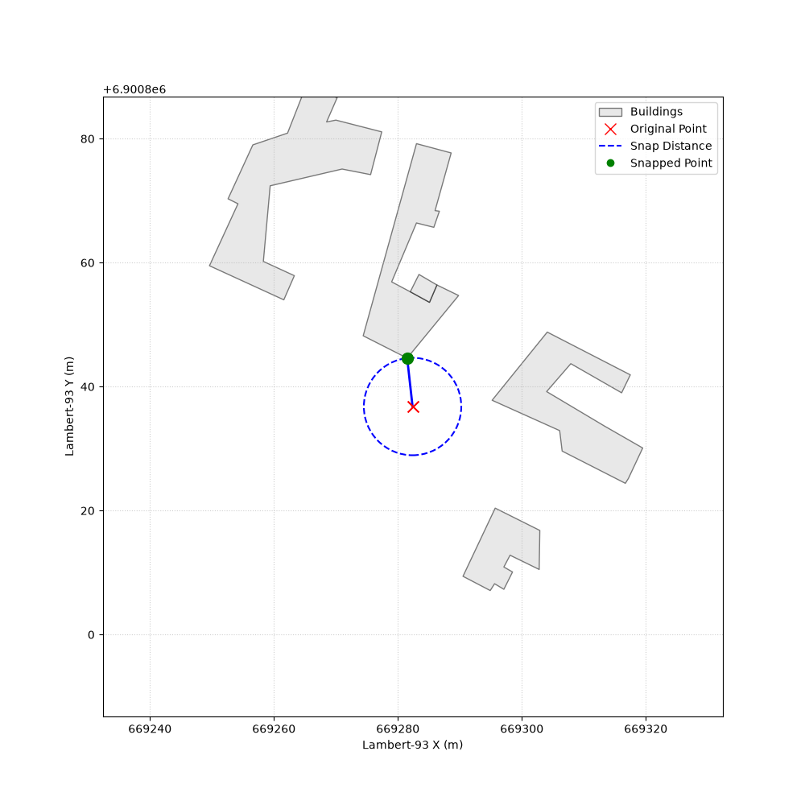

# Snapping

70% of cell site supports in the database are buildings.
Using the [calibrator](../graph-and-calibrator), we saw that often, the position given in the database is a few meters besides the building, hovering in the air.
This project uses [BD TOPO BÂTI](https://www.data.gouv.fr/datasets/bd-topo-r) building outlines to find the closest point of the closest building for these positions within a given radius.

Example snap: 